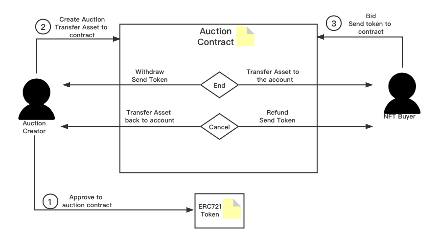

## Auction

### Reference

[Dutch auction](https://en.wikipedia.org/wiki/Dutch_auction)
[English auction](https://en.wikipedia.org/wiki/English_auction)

### Auction key

start time
end time
product
price
bid
bidder

### Auction process

general process : product => pricing => auction => start time => bid => Bidding method (Dutch auction /English auction / ... ) => end time => get product

### diagram ( "tokens" represents any ERC20/Native token)

> 

### Pseudo contract structur

```rust
gstd::metadata! {
    title: "Auction",
    init:
        input: InitConfig,
    handle:
        input: Action,
        output: Event,
    state:
        input: State,
        output: StateReply,
}

pub enum Action {
  Bid(u128),
  GetPrice(ActorId),
  Start(u128),
  End(u128),
  Withdraw(),
  Refund(),
}

pub enum Event {
  StartAction(),
  EndAction(),
  Bid(u128, ActorId),
  Withdraw(),
  Refund(),
  ChangeDate(),
}

pub enum State {
  StartAt(),
  ExpiresAt(),
  Price(),
}

pub enum StateReply {
  StartAt(),
  ExpiresAt(),
  Price(),
}

#[derive(Debug)]
struct Auction {
    start_at: u64,   // timestamp
    expires_at: u64, // timestamp
    price: u64,
}

impl Auction {
  fn start(&self) {}
  fn end(&self) {}
  fn get_price(&self) {}
  fn bid(&self) {}
  fn withdraw(&self) {}
  fn refund(&self) {}
}
```
